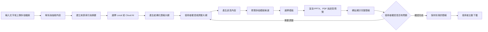
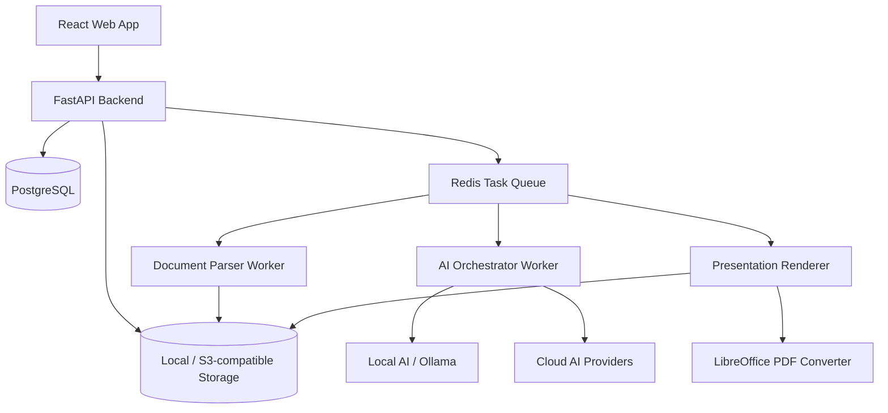

# AI 簡報生成平台

> 專案暫名：PPT Creator
> 文件狀態：產品規格與第一版實作 v0.2
> 目標：打造一個以本地 AI 為預設、也能串接雲端 AI API 的簡報生成網站。

## 1. 專案概述

本專案是一個 AI 簡報生成與管理平台。使用者可以輸入文字，或一次匯入多個 PDF、PPT/PPTX 等來源檔案，讓 AI 整理內容、產生簡報大綱，並套用多個候選模板預覽結果。

使用者選定模板後，系統會產生可再次編輯的 PowerPoint 檔案（`.pptx`），也可以輸出 PDF。生成完成後，網站會先直接顯示完整簡報的逐頁預覽，讓使用者確認內容與版面；只有在使用者確認沒有問題並主動按下「下載」後，檔案才會傳送到使用者裝置。

平台以本地端 AI 為預設執行方式，避免文件內容不必要地離開使用者環境；同時提供可插拔的 AI Provider 設計，讓使用者自行設定 API Key，選擇 OpenAI、Anthropic、Google Gemini 或其他相容 API 的模型。

## 2. 產品目標

- 讓非設計背景的使用者快速產生結構完整、風格一致的簡報。
- 支援文字及多份文件混合輸入，並保留各段內容的來源資訊。
- 預設使用本地 AI，兼顧資料隱私與離線使用需求。
- 允許使用者自行串接雲端 AI，提高模型選擇彈性。
- 產生真正可在 Microsoft PowerPoint 中修改的 `.pptx`，而不是把每頁輸出成不可編輯的圖片。
- 提供簡報歷史紀錄、版本、重新生成、下載及刪除等管理功能。
- 同一次生成提供多種模板候選，讓使用者先選擇視覺方向再完成輸出。

## 3. 預計使用情境

1. 使用者輸入一段主題、需求或既有文案，快速建立簡報。
2. 使用者一次上傳多份 PDF、PPTX，讓系統彙整成一份簡報。
3. 使用者同時輸入需求文字與參考文件，例如指定受眾、語氣、頁數及重點。
4. 使用者使用本機 Ollama 等服務生成內容，全程不呼叫外部 AI。
5. 使用者自行提供雲端模型 API Key，選擇更適合的模型生成簡報。
6. 使用者從歷史頁面找到已生成的簡報，重新下載、複製或用其他模板再生成。

## 4. 第一階段 MVP 範圍

### 4.1 輸入與資料匯入

- 文字輸入。
- 多檔案拖放上傳。
- 第一版支援格式：
  - PDF（`.pdf`）
  - PowerPoint（優先 `.pptx`；舊版 `.ppt` 可先透過 LibreOffice 轉換）
  - 純文字（`.txt`、`.md`）
- 顯示每個檔案的解析狀態、頁數、錯誤訊息與移除按鈕。
- 可填寫簡報語言、受眾、目的、語氣、預計頁數及額外指令。
- 掃描型 PDF 需透過 OCR；MVP 可先標記為第二優先，避免拖慢核心流程。

### 4.2 AI 生成流程

- 將多份來源資料解析成統一的內部文件格式。
- 對長文件進行分段、摘要及來源標記。
- 先產生結構化簡報大綱，再產生逐頁內容。
- 支援本地 AI 與使用者自帶 API Key（BYOK）的雲端 AI。
- 允許選擇模型、測試連線，並顯示目前使用的是本地或雲端模式。
- 生成失敗時保留工作狀態，支援重試，不必重新上傳全部檔案。

### 4.3 模板與預覽

- 每次生成提供至少 3 個模板候選，例如：
  - 商務簡約
  - 科技深色
  - 教育／報告
- 模板控制色彩、字體、留白、版型、圖表與圖片風格。
- 使用縮圖預覽模板套用後的代表頁面。
- 使用者選擇模板後才進入正式渲染。
- 同一份內容可以切換模板重新輸出，不需要重新呼叫 AI 產生內容。
- 正式渲染完成後，網站直接顯示整份簡報，而不只顯示代表頁縮圖。
- 提供投影片縮圖列、上一頁／下一頁、頁碼與全螢幕預覽。
- 預覽內容需使用正式輸出的 PPTX／PDF 渲染結果，盡量確保網站所見與下載檔案一致。
- 使用者可在預覽階段返回調整大綱、內容或模板，重新渲染後再確認。

### 4.4 簡報管理

- 「我的簡報」列表頁。
- 顯示標題、縮圖、建立時間、更新時間、狀態、頁數及使用模型。
- 支援搜尋、排序及狀態篩選。
- 可開啟簡報詳情、重新生成、套用其他模板、複製及刪除。
- 已完成檔案儲存在伺服器／本地應用資料目錄，按下下載按鈕後才傳送到瀏覽器。
- 下載格式：
  - 可編輯 PowerPoint（`.pptx`）
  - PDF（`.pdf`）

### 4.5 設定

- 本地 AI 服務網址與模型選擇，例如 Ollama。
- 雲端 AI Provider、Base URL、模型名稱及 API Key。
- API Key 只允許新增、替換、刪除及測試，不回傳完整明文。
- 預設語言、預設頁數、預設模板及檔案保存期限。

## 5. 暫不納入 MVP

- 瀏覽器內完整的 PowerPoint 所見即所得編輯器。
- 多人即時共同編輯。
- 動畫、轉場、旁白及影片自動生成。
- 模板商城與金流。
- 直接同步到 Google Slides 或 Microsoft 365。
- 對所有舊版、加密或含複雜巨集的 PowerPoint 提供完整相容性。

上述功能可在核心生成、下載及管理流程穩定後再逐步加入。

## 6. 核心使用流程



建議保留「確認大綱」步驟。若直接從文件生成最終簡報，使用者只能在完成後才發現頁數、順序或重點不符，會造成較高的重新生成成本。

## 7. 建議技術架構

### 7.1 技術選型

| 層級 | 建議技術 | 用途 |
| --- | --- | --- |
| 前端 | React、TypeScript、Vite | 建立操作介面與 SPA |
| UI | Tailwind CSS、shadcn/ui | 快速建立一致的元件與主題 |
| 狀態管理 | TanStack Query、Zustand | 管理伺服器資料與前端編輯狀態 |
| 後端 | Python、FastAPI | 文件解析、AI 編排、任務與下載 API |
| 任務佇列 | Redis、Celery 或 Dramatiq | 處理長時間的解析與簡報生成工作 |
| 資料庫 | PostgreSQL | 所有環境統一使用，保存使用者、專案、生成紀錄、設定與版本 |
| 檔案儲存 | 本地檔案系統，之後可換 S3 相容儲存 | 原始文件、縮圖、PPTX、PDF |
| 本地 AI | Ollama API（首要支援） | 在本地端執行 LLM |
| 雲端 AI | Provider Adapter | 串接 OpenAI、Anthropic、Gemini 等 API |
| PPTX 產生 | PptxGenJS，或 Python-pptx 搭配版型引擎 | 建立可編輯的 PowerPoint 物件 |
| PDF 轉換 | LibreOffice Headless | 將完成的 PPTX 轉成 PDF |

第一版採用 `React + FastAPI + PostgreSQL + Redis`。開發、測試與正式環境統一使用 PostgreSQL，開發環境可透過 Docker Compose 啟動，避免 SQLite 與 PostgreSQL 在型別、查詢及 migration 行為上的差異。Python 生態較適合 PDF、OCR、文件解析與 AI pipeline；PPTX 渲染可以獨立成 Node.js worker 使用 PptxGenJS，或先用 Python-pptx 完成原型。

### 7.2 系統元件



## 8. AI Provider 設計

所有模型都應透過統一介面呼叫，避免生成流程直接依賴某一家服務：

```ts
interface AIProvider {
  listModels(): Promise<ModelInfo[]>;
  testConnection(): Promise<ConnectionResult>;
  generateStructured<T>(request: GenerationRequest): Promise<T>;
}
```

預計 Provider：

- `OllamaProvider`：預設本地模型介面。
- `OpenAIProvider`：OpenAI API。
- `AnthropicProvider`：Anthropic API。
- `GeminiProvider`：Google Gemini API。
- `OpenAICompatibleProvider`：支援自訂 Base URL、模型名稱及 API Key，方便串接其他相容服務。

AI 不應直接產生 PPTX 二進位檔。較穩定的方式是要求模型輸出經 Schema 驗證的 JSON，再交給固定的模板／排版引擎渲染。這樣可以降低格式損壞、版面失控及不同模型輸出不一致的問題。

### 8.1 建議的簡報內容格式

```json
{
  "title": "簡報標題",
  "language": "zh-TW",
  "audience": "目標受眾",
  "slides": [
    {
      "id": "slide-01",
      "layout": "title-content",
      "title": "頁面標題",
      "summary": "本頁核心訊息",
      "bullets": ["重點一", "重點二"],
      "speakerNotes": "講者備註",
      "visualIntent": {
        "type": "chart",
        "description": "建議使用的視覺內容"
      },
      "sourceRefs": ["source-01#page=3"]
    }
  ]
}
```

輸出必須經過 JSON Schema 或 Pydantic 驗證；驗證失敗時可要求模型修復格式，而不是直接讓整個任務失敗。

## 9. 文件處理策略

### 9.1 統一文件格式

所有輸入先轉換為標準化區塊：

```ts
type SourceBlock = {
  sourceId: string;
  sourceName: string;
  sourceType: "text" | "pdf" | "pptx" | "other";
  page?: number;
  slide?: number;
  text: string;
  metadata?: Record<string, unknown>;
};
```

### 9.2 處理步驟

1. 驗證副檔名、MIME type、檔案大小及檔案數量。
2. 為每個來源建立獨立紀錄與校驗值，避免重複上傳。
3. 抽取文字、頁碼、投影片編號及基本結構。
4. 對掃描文件進行 OCR（若已啟用）。
5. 清理頁首頁尾、重複空白與無意義內容。
6. 長文件依語意與 token 限制分段。
7. 對每段建立摘要與來源引用。
8. 合併成生成簡報所需的內容上下文。

來源引用應一路保留到投影片內容，方便日後顯示「這一頁來自哪些檔案／頁面」，也能降低內容無法追溯的問題。

## 10. 可編輯 PPTX 的實作原則

- 標題、內文、圖形、表格與圖表盡量建立為原生 PowerPoint 物件。
- 不把整張投影片扁平化成單一圖片。
- 使用固定的版面網格、安全邊界、字級範圍及內容長度限制。
- 文字溢出時依序採用：縮短內容、拆頁、切換版型；避免無限制縮小字體。
- 模板需定義可用版型，例如封面、章節、雙欄、數據、圖表、圖片、結論。
- 圖片可被替換，但圖片本身不是 PowerPoint 內可編輯的向量內容，需在介面上說明。
- 使用常見或可嵌入字型，避免跨裝置開啟後版面位移。
- PDF 由同一份 PPTX 轉換而來，確保兩種輸出內容一致。

## 11. 模板系統

模板不只是一張背景圖，而是一組可重複套用的設計規則：

```ts
type PresentationTemplate = {
  id: string;
  name: string;
  version: string;
  thumbnail: string;
  theme: {
    colors: Record<string, string>;
    fonts: Record<string, string>;
    spacing: Record<string, number>;
  };
  layouts: LayoutDefinition[];
};
```

模板應具備版本號。既有簡報要記錄當時使用的模板版本，避免模板更新後導致舊簡報無法一致地重新輸出。

模板候選的第一版可以對同一份簡報 JSON 套用不同模板，產生代表頁縮圖；不需要為每個模板重新呼叫一次 AI。

## 12. 頁面規劃

| 頁面 | 主要功能 |
| --- | --- |
| 首頁／建立簡報 | 文字輸入、多檔上傳、生成設定、開始建立 |
| 資料解析進度 | 顯示各檔案解析結果與錯誤 |
| 大綱編輯 | 調整標題、章節、順序、頁數及重點 |
| 模板選擇 | 預覽多種風格並選擇模板 |
| 生成進度 | 顯示內容生成、渲染、PDF 轉換狀態 |
| 簡報預覽 | 逐頁顯示正式渲染結果、切換頁面、全螢幕檢視、返回修改及確認完成 |
| 簡報詳情 | 預覽、版本、來源、重新生成及下載 |
| 我的簡報 | 搜尋、排序、篩選、複製及刪除 |
| AI 設定 | 管理 Local/Cloud Provider、模型及 API Key |
| 系統設定 | 語言、預設模板、檔案保存期限 |

## 13. 任務狀態

生成工作建議使用明確的狀態機：

```text
DRAFT
  -> UPLOADING
  -> PARSING
  -> OUTLINE_READY
  -> GENERATING_CONTENT
  -> TEMPLATE_SELECTION
  -> RENDERING
  -> PREVIEW_READY
  -> COMPLETED

任何處理階段 -> FAILED
FAILED -> 從可恢復的階段 RETRY
```

前端可先使用輪詢取得進度，之後再升級為 Server-Sent Events 或 WebSocket。

## 14. 初步資料模型

| 實體 | 重要欄位 |
| --- | --- |
| `users` | id、email、display_name、created_at |
| `ai_provider_configs` | user_id、provider、base_url、model、encrypted_api_key、enabled |
| `presentations` | id、user_id、title、status、language、current_version_id、created_at |
| `presentation_versions` | presentation_id、version、outline_json、content_json、template_id、template_version、model_info |
| `source_files` | presentation_id、original_name、mime_type、size、checksum、storage_key、parse_status |
| `source_blocks` | source_file_id、page_or_slide、text、metadata |
| `templates` | id、name、version、manifest、preview_key、enabled |
| `generation_jobs` | presentation_id、stage、status、progress、error_code、error_message、started_at |
| `artifacts` | presentation_version_id、type、storage_key、size、checksum、created_at |

若第一版只做單機使用，可以先不實作完整帳號系統，但資料表仍保留 `user_id` 的概念，方便之後升級為多人平台。

## 15. 初步 API 規劃

### 簡報與來源

```http
POST   /api/v1/presentations
GET    /api/v1/presentations
GET    /api/v1/presentations/{id}
PATCH  /api/v1/presentations/{id}
DELETE /api/v1/presentations/{id}

POST   /api/v1/presentations/{id}/sources
GET    /api/v1/presentations/{id}/sources
DELETE /api/v1/presentations/{id}/sources/{sourceId}
```

### 生成流程

```http
POST   /api/v1/presentations/{id}/parse
POST   /api/v1/presentations/{id}/outline
PATCH  /api/v1/presentations/{id}/outline
POST   /api/v1/presentations/{id}/generate
GET    /api/v1/jobs/{jobId}
POST   /api/v1/jobs/{jobId}/retry
```

### 模板與輸出

```http
GET    /api/v1/templates
GET    /api/v1/templates/{id}
POST   /api/v1/presentations/{id}/render
GET    /api/v1/presentations/{id}/preview
POST   /api/v1/presentations/{id}/confirm
GET    /api/v1/presentations/{id}/artifacts
GET    /api/v1/artifacts/{artifactId}/download
```

下載 API 必須檢查檔案擁有者及權限，並透過串流回傳檔案；不能讓儲存路徑直接暴露給前端。

### AI 設定

```http
GET    /api/v1/ai-providers
POST   /api/v1/ai-providers
PATCH  /api/v1/ai-providers/{id}
DELETE /api/v1/ai-providers/{id}
POST   /api/v1/ai-providers/{id}/test
GET    /api/v1/ai-providers/{id}/models
```

## 16. 安全性與隱私

- 雲端 AI 呼叫前清楚標示資料將傳送至外部服務。
- 本地模式不可因錯誤或逾時而自動降級到雲端模型。
- API Key 需加密保存，且不可寫入 log、前端狀態或錯誤追蹤內容。
- 上傳檔案需限制大小、數量、格式及解析時間。
- 對壓縮型格式防範 zip bomb、路徑穿越及惡意嵌入檔案。
- 下載、預覽、刪除及重新生成都必須驗證資源所有權。
- 設定原始檔、暫存檔及輸出檔的保存期限與清理機制。
- 應記錄 AI Provider、模型、模板版本及生成時間，但避免記錄敏感原文。

## 17. 目前專案結構

```text
PPT-Creator/
├── app/                      # React 前端頁面、互動與樣式
├── backend/                  # FastAPI 與 PostgreSQL 資料模型
│   └── app/
├── design-system/            # 介面設計規則
├── public/                   # 網站公開資源
├── tests/                    # 前端渲染測試
├── worker/                   # 網站執行入口
├── docker-compose.yml        # PostgreSQL 與 API 開發環境
├── .env.example
└── README.md
```

目前已完成第一版操作介面：建立簡報、加入參考檔案、生成進度、逐頁完整預覽、確認後下載可編輯 PPTX、我的簡報與設定頁。後端已建立 PostgreSQL 資料模型，以及簡報建立、列表、讀取與確認 API；文件解析、模型串接與正式 PDF 渲染仍依里程碑逐步實作。

## 18. 開發里程碑

### Milestone 0：技術驗證

- 驗證 PDF、PPTX 文字抽取。
- 驗證 Ollama 與至少一個雲端 API 的統一 Provider 介面。
- 使用固定 JSON 產生 3 至 5 頁可編輯 PPTX。
- 使用 LibreOffice 將 PPTX 轉成 PDF 並產生縮圖。

### Milestone 1：最小生成閉環

- React 建立頁、多檔上傳及進度顯示。
- FastAPI 建立簡報、上傳與生成 API。
- 文字／PDF／PPTX 解析。
- AI 大綱與逐頁內容生成。
- 單一模板輸出 PPTX、PDF。

### Milestone 2：模板與內容確認

- 大綱編輯與重新排序。
- 至少 3 個模板候選與縮圖預覽。
- 模板切換不重新呼叫 AI。
- 內容溢出偵測及自動拆頁。

### Milestone 3：簡報管理

- 我的簡報列表與詳情頁。
- 版本、複製、刪除、重新生成與下載。
- 任務重試、錯誤訊息及檔案清理。

### Milestone 4：可部署與安全強化

- 帳號及權限。
- API Key 加密與安全設定。
- PostgreSQL migration、Redis、物件儲存。
- Docker Compose、監控、備份與部署文件。

## 19. MVP 驗收標準

- 使用者可在同一個專案輸入文字並上傳多個 PDF/PPTX。
- 系統能顯示每個來源的解析成功或失敗狀態。
- 使用者可選擇 Ollama 或至少一個雲端 AI Provider。
- 生成流程先產生可調整的大綱，再產生逐頁內容。
- 同一份內容至少提供 3 種模板預覽。
- 產出的 `.pptx` 可用 Microsoft PowerPoint 開啟並修改文字、形狀及表格。
- 系統可輸出與 PPTX 內容一致的 PDF。
- 正式渲染完成後，網站會直接逐頁顯示整份簡報，使用者不必先下載檔案才能查看成果。
- 網站預覽應來自正式輸出檔的渲染結果，且可透過縮圖、上一頁／下一頁及全螢幕模式檢查每一頁。
- 使用者可從預覽返回修改內容或模板，重新渲染並再次確認。
- 已生成簡報可在「我的簡報」中再次查看及下載。
- 未按下載前，瀏覽器不會自動接收輸出檔案。
- 任務失敗時會顯示可理解的錯誤，並可從合理階段重試。

## 20. 需要後續確認的產品決策

以下問題不阻礙第一階段技術驗證，但會影響正式版本設計：

1. 第一版是單機單人使用，還是直接提供多人註冊與登入？
2. 是否需要完全離線，包括字型、圖片素材及 OCR 都不得連網？
3. 雲端 API Key 由使用者自行提供，或平台也會提供共用額度？
4. 第一版是否需要 AI 生成圖片，或只使用圖示、圖表與使用者素材？
5. 單次上傳檔案數量、單檔大小與最大總頁數限制為何？
6. 簡報檔案預設保存多久？使用者刪除後是否需要回收站？
7. PowerPoint 的相容目標是 Microsoft 365、PowerPoint 2021，還是需支援更舊版本？
8. 是否需要保留來源引用並顯示在投影片或講者備註中？

## 21. 建議的下一步

先完成 Milestone 0 的技術驗證，再建立完整介面。最優先確認的不是頁面外觀，而是以下三件事：

1. 多份 PDF/PPTX 是否能可靠地抽取並追蹤來源。
2. AI 是否能穩定輸出符合 Schema 的簡報 JSON。
3. 模板引擎是否能輸出真正可編輯且不容易溢版的 PPTX。

這三項驗證通過後，再建立 React 使用流程，可以大幅降低後續重寫的風險。
